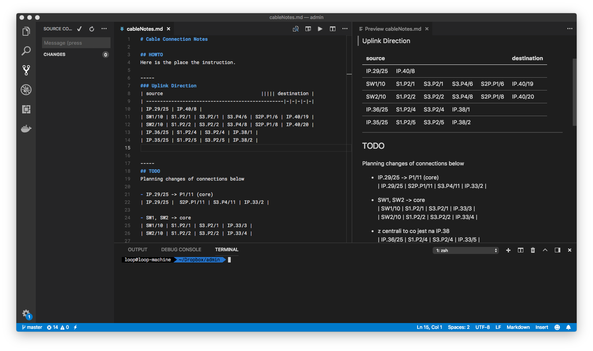
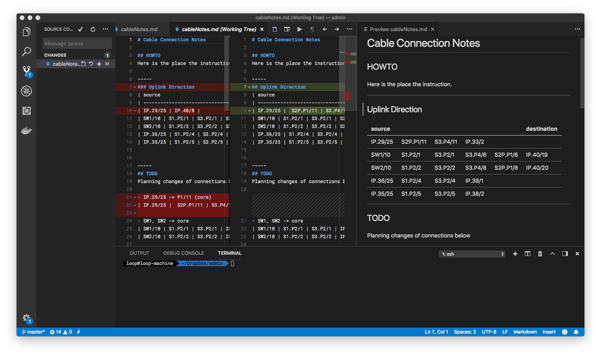
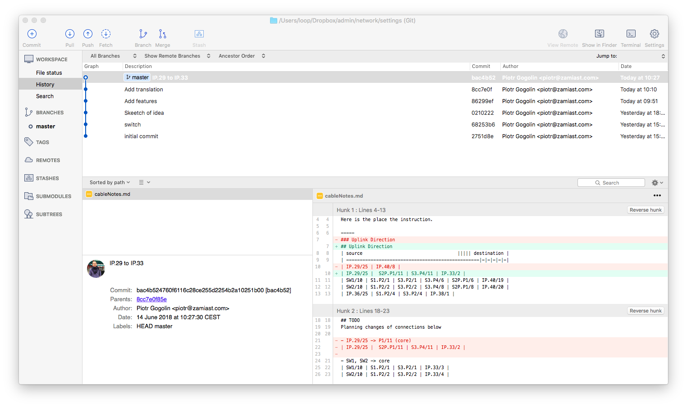

# Cable Notes

This is a concept solution for network administrators to make changes in network cable connection under control. I show you my idea how to use developer tools like git or vscode to managing network coble connections, switches, patch panels, and cabinets. Logging changes is simple from today.

---

## Idea

We could use simply text file in Markdown format (for quite nice PDF creation to create report) and observe changes with git. Is it too simple? No. I spent many hours to find a free graphic solution to write down connections and changes in LAN. And one day...

It seems to me that it will meet my expectations.

---

## Environment

I use following set of tools (you can choose yours):

1. Code editor - [Visual Studio Code][1].
2. [Git][2] 
3. [SourceTree][3] 

---

## How it works

With a simply text file with Git we have a tool with following features:
1. History of commits
2. Preview of markdown file
3. Export PDF file from markdown
4. Planning chances in TODO section
5. Highlighting string - part of selected panel, switch, etc.
6. Using `SourceTree` (or similar tool) to see commited changes
7. Using `grep` to see device connection in large file.
8. Preview modification in Code.

---

## OK, but how?

### Use a text file

Pure text in markdown format

I put in two sections:
1. Uplink Direction (to remember always using one direction: from endpoint to the switch)
2. TODO. For planned changes. To copypasting.

### Formatting source

It should be planned for using text tools in the future (like grep for example).
```
| source                                   ||||| destination |  
| -------------------------------------------------|-|-|-|-|-|
| Room002 | pc-0409 | S3.P7/12 | IP.38/1 |
| Room005 | pc-0406 | S3.P7/14 | IP.38/2 |
```

### Naming conventions

You should have constant naming conventions. Think about the future. Do I have to talk about it? 

#### Socket signing policy
```
S2.P2/4
||  | |___ port (1,23...)
||  |_____ patchpanel (P2,P10...)
||________ cabinet number (1,2,...)
|_________ server rack cabinet (S)
```

### Step by step

Here you see my file in prenatal state. On the left *Uplink direction* section, on the right markdown preview (you need a plugin probably) 


After changes and save file we use built-in *Source control* in VSCode. We can see our changes and make `git commit` directly from a little window on the top.


AND HERE is **the Main Feature**. Preview of changes. Log of commits. Excellent. You see who, when, what. You can siply turn back wrong decisions...


---

## Links

- https://code.visualstudio.com/ 
- https://git-scm.com/           
- https://www.sourcetreeapp.com  

[1]: https://code.visualstudio.com/ 
[2]: https://git-scm.com/           
[3]: https://www.sourcetreeapp.com  
